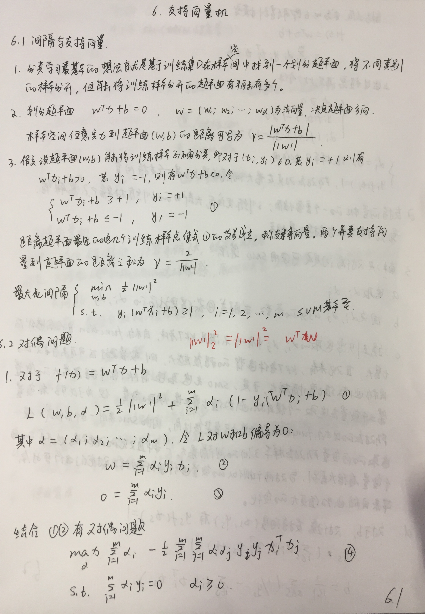
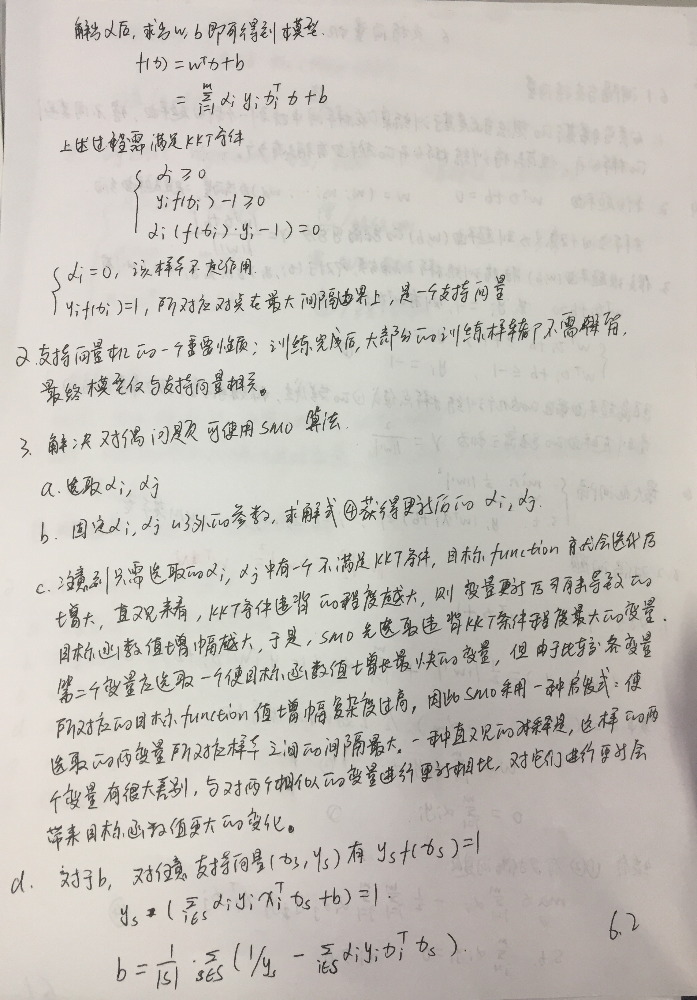
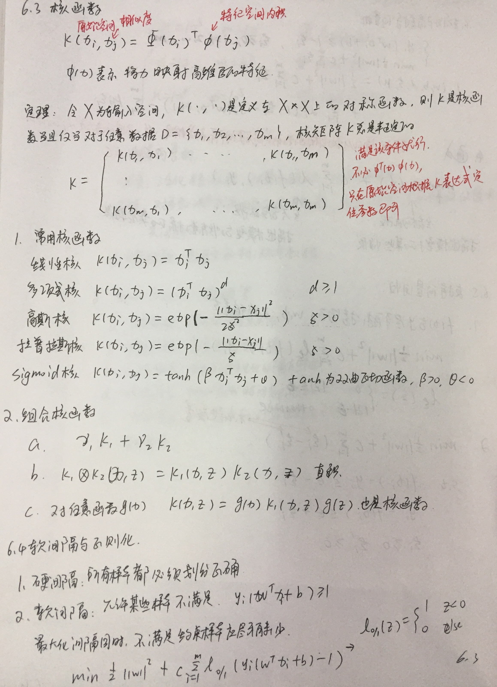
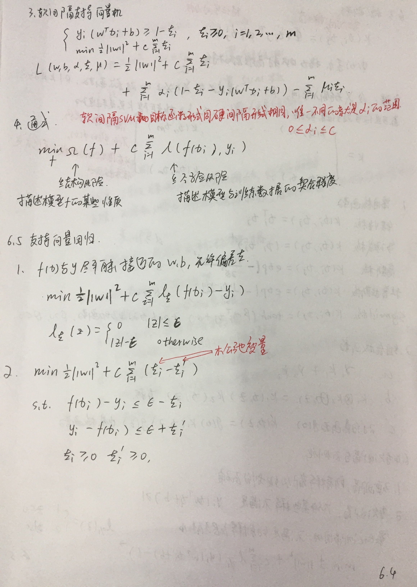
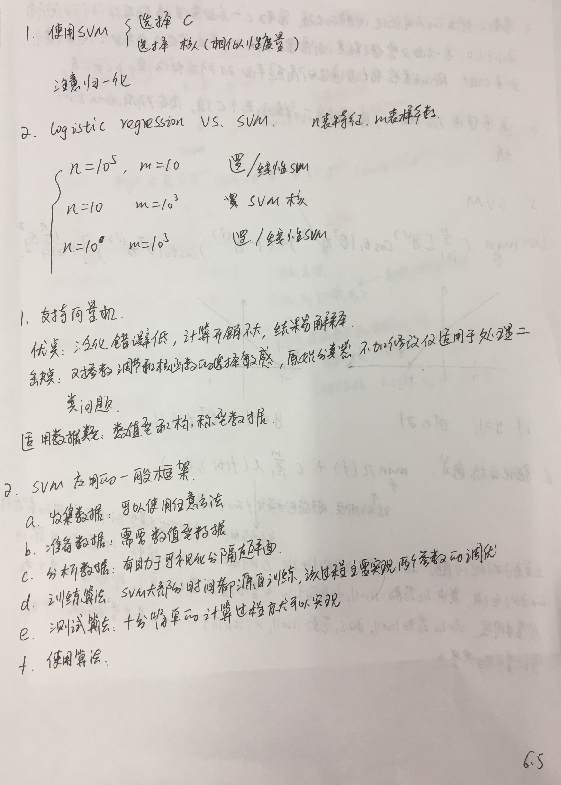
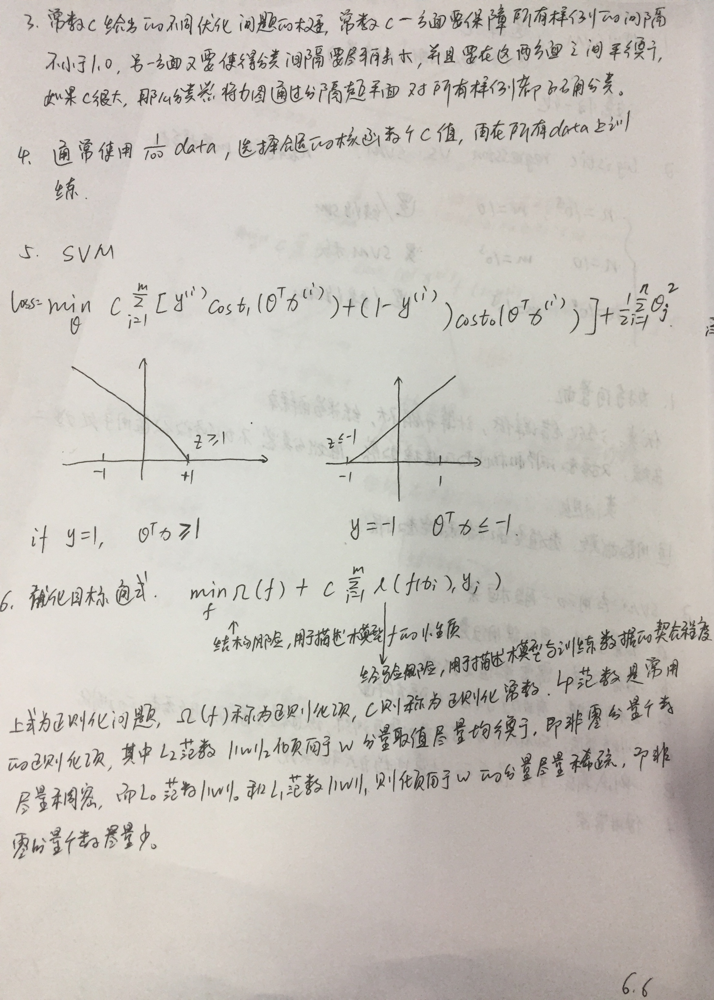
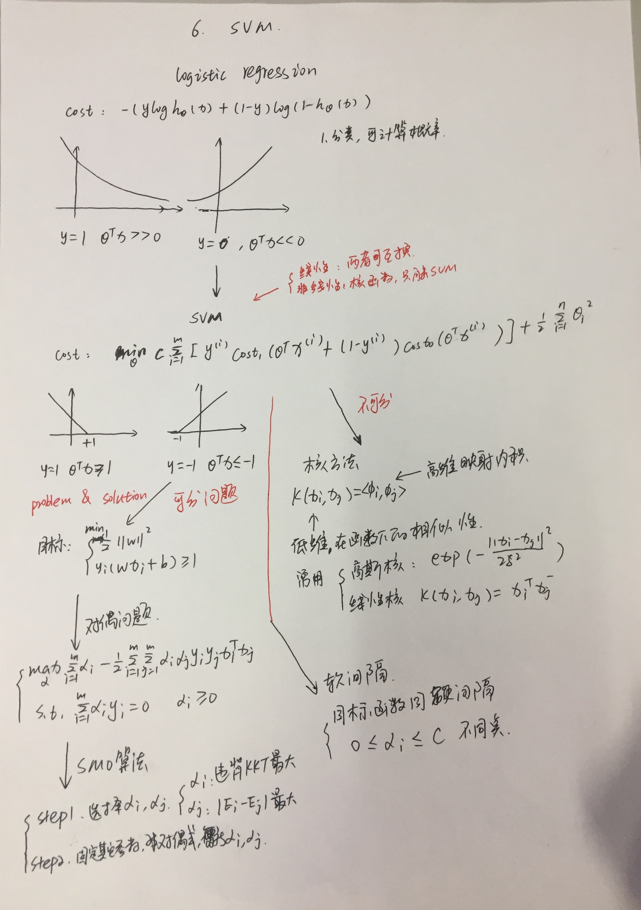
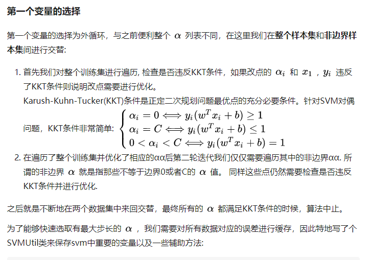
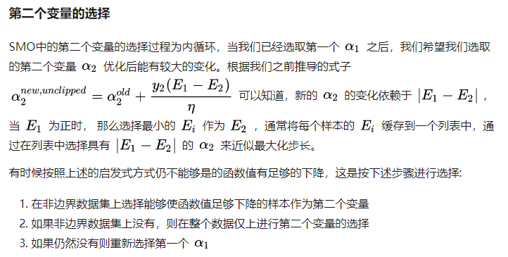
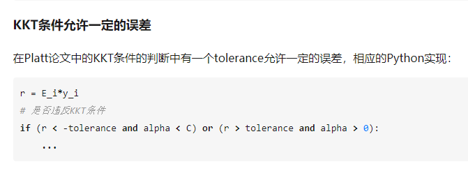

## 本章主要内容
* why svm
    * 线性可分， 可用逻辑回归替代
    * 线性不可分问题，使用核函数
* how solve svm问题
    * 转换为对偶问题
    * 使用SMO解决对偶问题，获得原问题的解
    
    
    
    
## 手写笔记

## svm 

* 支持向量的数目存在一个最优值，SVM的优点在于它能对数据进行高效分类，如果支持向量太少，就可能会得到一个很差的决策边界，
如果支持向量太多，也就相当于每次都利用真个数据集进行分类，这号给你分类方法称为knn。
* knn效果确实不错，但是需要保留所有的训练样本，而对于支持向量机而言，其需要保留的样本少了很多（支持向量）。
* 支持向量机是一种分类器。之所以叫做机是因为它会产生一个二值决策结果，即它是一种决策机。支持向量机的泛化能力错误率较低，
也就是说它具有良好的学习能力且学到的结果具有良好的推广性，这些优点使得支持向量机十分流行。【‘

## 对偶问题

* [拉格朗日乘子法](https://github.com/jiye-algorithm/math/blob/master/%E6%8B%89%E6%A0%BC%E6%9C%97%E6%97%A5%E4%B9%98%E5%AD%90%E6%B3%95.jpg)

## SMO算法

### SMO中启发式选择变量

* 在SMO算法中，我们每次需要选取一对 \alpha 来进行优化，
通过启发式的选取我们可以更高效的选取待优化的变量使得目标函数下降的最快。
针对第一个 \alpha_1 和第二个\alpha_2 Platt SMO采取不同的启发式手段。

#### 第一个变量的选择

* 第一个变量的选择为外循环，与之前便利整个 \alpha 列表不同，在这里我们在整个样本集和非边界样本集间进行交替:

### 参考文献
* [支持向量机(SVM)（五）-- SMO算法详解](https://blog.csdn.net/u011067360/article/details/26503719)
* [机器学习算法实践-SVM中的SMO算法](https://zhuanlan.zhihu.com/p/29212107)
* [支持向量机系列（5）——SMO算法解对偶问题](https://zhuanlan.zhihu.com/p/28299882)
* [机器学习算法实践-Platt SMO和遗传算法优化SVM](https://zhuanlan.zhihu.com/p/30173372)

## 核函数

* 在低维空间度量任意两个样本之间的相似性，作为高维空间样本对于点的內积
* 可以把和函数想象成包装器或者接口，它能把数据从某个很难处理的形式转换成另一个比较容易处理的形式
* 我们可以在高维空间中解决线性问题，这也等价于在低维空间中解决非线性问题。
* SVM优化中一个特别好的地方就是，所有的运算都可以写成內积形式，可以把內积运算替换成核函数，而不必简化处理，
将內积转换成核函数的形式被称为核技巧。

## 杂谈

### 学习本章使用的内容

* 优达学城 《机器学习基础》
    * [课程](https://classroom.udacity.com/courses/ud120/lessons/2252188570/concepts/30294285900923)
    * [代码](https://github.com/udacity/ud120-projects)
* 《机器学习》周志华
    * 基本理论都能估计到，但是写的比较高深，需要一定的辅助，
    * 可以选择博客，补充概念
* 《python大战机器学习》 
    * 第一是对西瓜书的补充，第二是API实现，学习已有的函数的用法
* 吴恩达机器学习视频 SVM一节
    * 理解了很多的概念，算得上一个层次的视角，但是需要一定的基础
