## 手写笔记

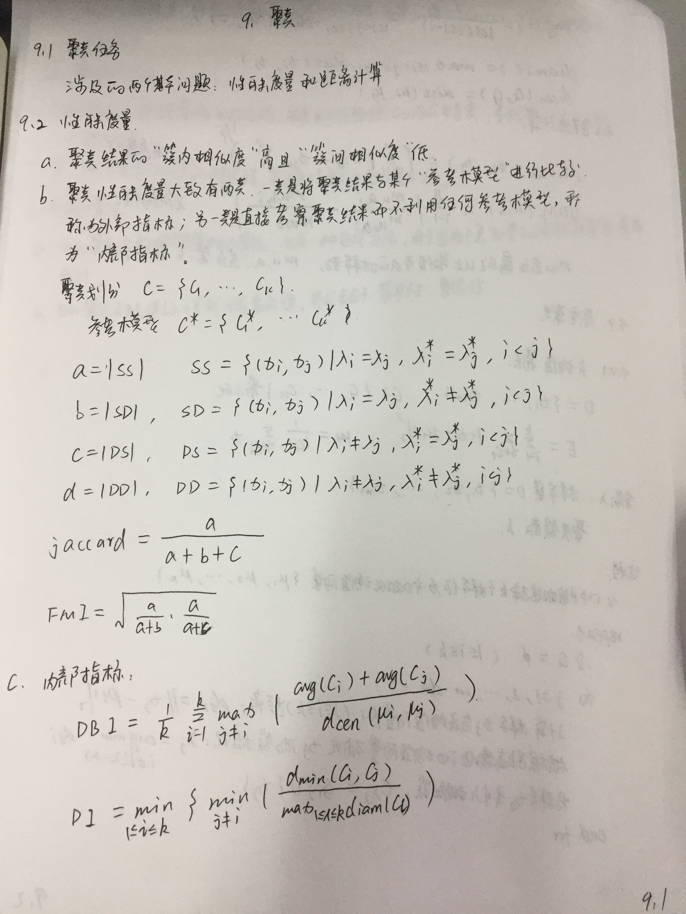



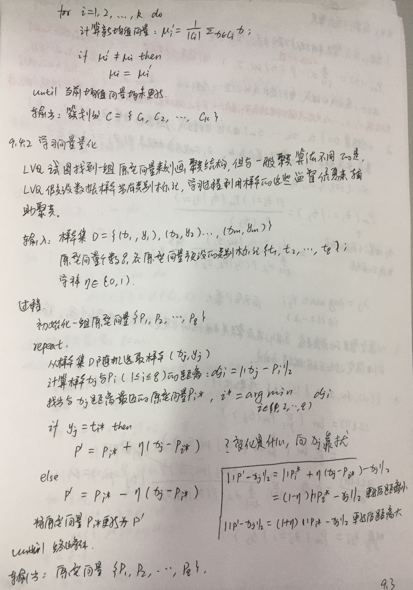

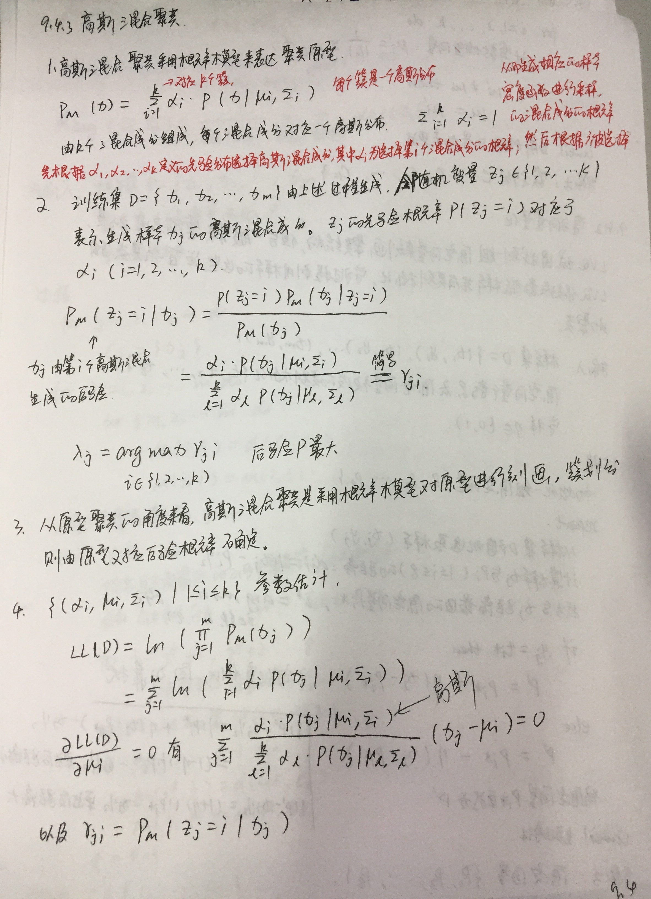

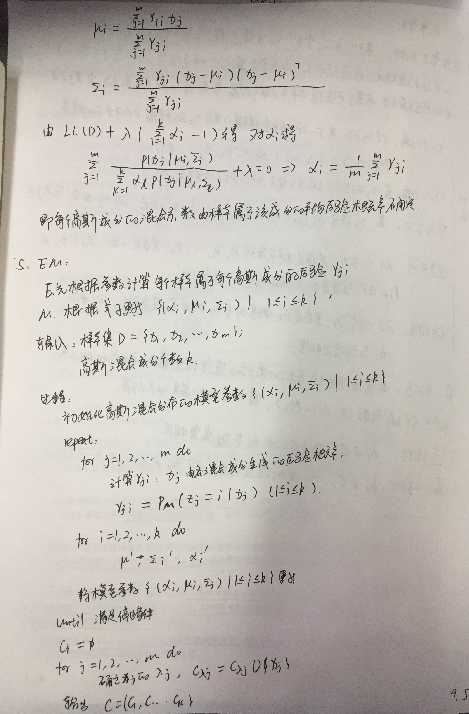

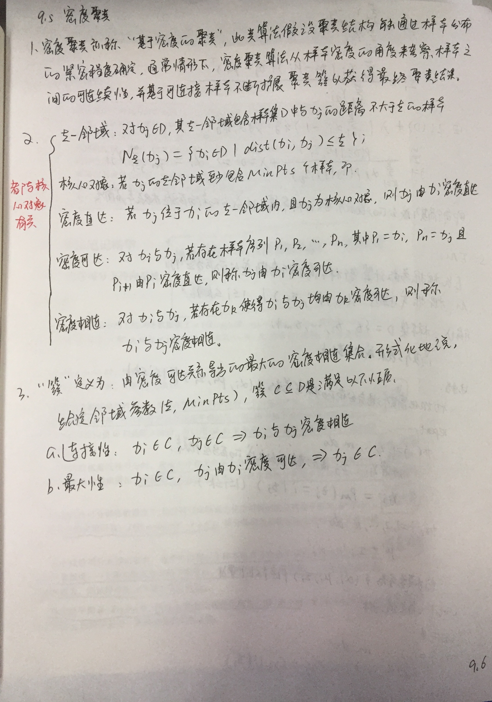

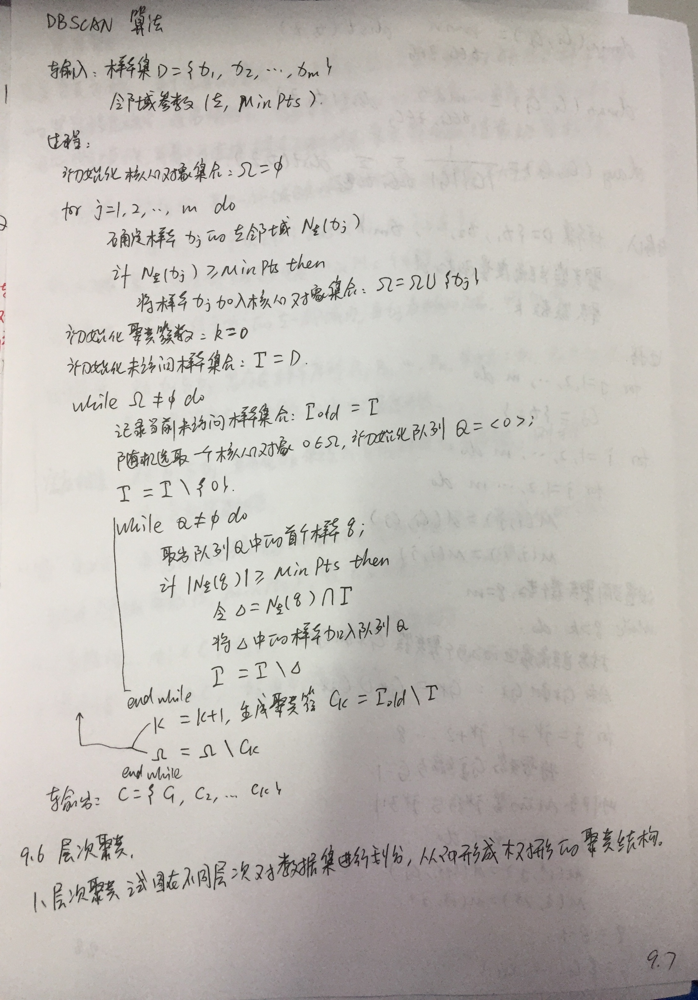



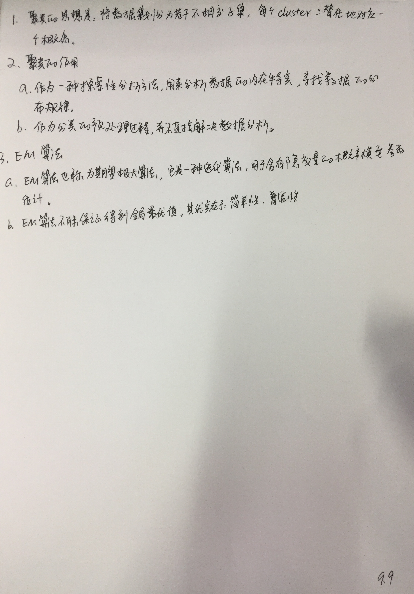





## 密度聚类

* 划分方法聚类算法与层次聚类算法把距离（欧氏距离，闵可夫斯基距离，曼哈顿距离）作为两个样本或者两个簇之间相似度的评价指标，
因此导致了划分方法聚类算法和层次聚类算法旨在发现球状簇，对任意形状的聚类簇比较吃力。

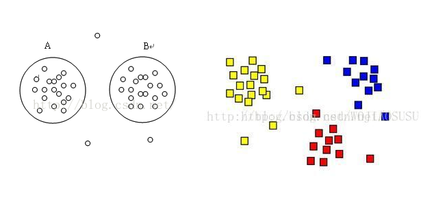

* 可以把簇看做数据空间中被稀疏区域分开的稠密区域，基于密度聚类算法假设聚类结构能够通过样本分布的紧密程度确定，
* 基于密度聚类算法的主要特点是：
    1. 发现任意形状的簇
    2. 处理噪声
    3. 一次扫描
    4. 需要密度参数作为终止条件
* 主要的聚类算法有：DBSCAN，OPTICS，DENCLUE等。



### DBSCAN 

* DBSCAN是一种著名的密度聚类算法，基于一组领域参数(r, MinPts)来刻画样本的紧密程度。
* 基本概念：
    * r-领域：对任意Xi属于数据集D其r领域包含样本集D中与X的距离不大于r的样本，N(Xi) = {Xj属于D， dist(xi,xj) <= r}
    * 核心对象： 核心对象就是r领域内至少包含MinPts个样本，N(xi) >= MinPts
    * 密度直达：如果xj位于xj的r-领域内，并且xi是核心对象， 则称xj由xi密度直达
    * 密度可达：对xi和xj，如果存在样本序列p1,p2,...,pn，其中p1=xi, pn=xj且p(i+1)由pi密度直达，责成xj由xi密度可达
    * 密度相连：对xi和xj，如果存在xk使得xi和xj均由xk密度可达，则称xi与xj密度相连。
   
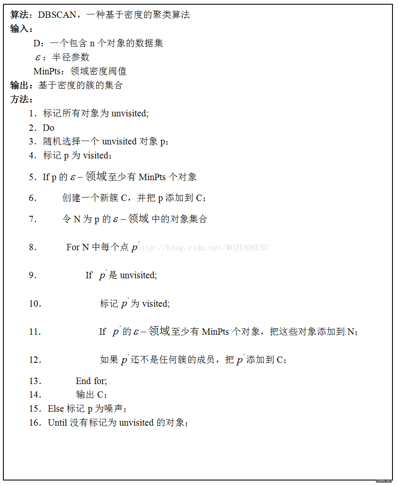

#### DBSCAN的优缺点以及改进的方向

* 算法的优点是聚类速度快，能够有效处理噪声点和发现任意形状的空间聚类，但是由于它直接对整个数据库进行操作且进行聚类时
使用了一个全局性的表征密度的参数，因此具有比较明显的弱点。
    * 当数据量增大时，要求较大的内存支持IO消耗也很大
    * 当空间聚类密度不均匀、聚类间距离相差很大时，聚类质量较差
    * 与用户输入的领域半径及密度阈值密切相关，可能由于用户对数据特点不了解而输入不合适的参数得出不准确的结论，参数敏感
    * 算法过滤噪声点同时也是其缺点，造成了不其适用于某些领域。
* 与K-Means算法相比较DBSCAN算法的优点
    * 不必输入聚类数量K
    * 聚类簇的形状没有任何限制
    * 可以在需要的时候输入过滤噪声的参数
    
* [密度聚类算法](https://blog.csdn.net/wojiaosusu/article/details/57403386)




### OPTICS算法，全称是Ordering points to identify the clustering structure

* 基于密度的簇是关于领域阈值单调的，在DBSCAN中，对于固定的MinPts值和两个领域R1<r2，关于r1的簇一定是关于r2簇的子集、
意味着，如果两个对象在同一个基于密度的簇中，则他们也一定在同一个具有较低密度的簇中。

* DBSCAN使用了全局参数聚类效果不是很好，尤其是高维数据集，数据倾斜可能比较严重，为了克服全局参数这一缺点，
引入了OPTICS算法，OPTICS并不显式的产生聚类簇，而是输入点排序。
这个排序是属于分析对象的线性表（按距离的远近），并且代表了数据的基于密度的聚类结构。
OPTICS聚类算法不需要用户提供特定的密度阈值，簇排序可以用来提取基本的聚类信息，导出内在的聚类结构。

* 基本概念：
    * 核心距离：对象p的核心距离是最小的ξ’值，即使得对象p的ξ’领域内至少有MinPts个对象，即ξ’是使得对象p成为
    核心对象的最小半径阈。如果p不是关于ξ’和MinPts的核心对象，那么p的核心距离就没有定义
    * 可达距离：从对象q到对象p的可达距离是使p从q密度可达的最小半径值。q必须是核心对象，并且p必须在q的领域内，
    从q到p的可达距离max{core_distance(q), dist(p, q)}，如果q不是核心对象，那么可达距离没有定义。
    可达距离是核心对象（必须要有核心对象）与其邻域点的距离（邻域为ξ范围，不是ξ’范围）。
    
    > *下面是公式参考*
    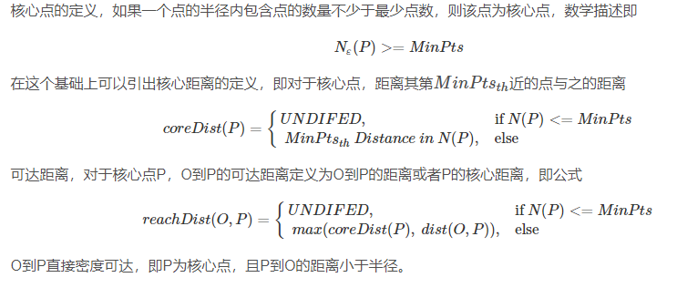
    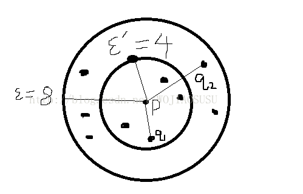

* [OPTICS算法-基础讲解](https://blog.csdn.net/wojiaosusu/article/details/57416635)
* [维基百科](https://en.wikipedia.org/wiki/OPTICS_algorithm)
* [OPTICS算法-提炼说明](https://blog.csdn.net/xuanyuansen/article/details/49471807)

* OPTICS算法思想如下所示：
  
    * 输入：数据样本D，初始化所有点的可达距离和核心距离为MAX，半径，和最少点数。
    
    1. 建立两个队列，有序队列（核心点及该核心点的直接密度可达点），结果队列（存储样本输出及处理次序）
    
    2. 如果D中数据全部处理完，则算法结束，否则从D中选择一个未处理且未核心对象的点，将该核心点放入结果队列，
    该核心点的直接密度可达点放入有序队列，直接密度可达点并按可达距离升序排列；
    
    3. 如果有序序列为空，则回到步骤2，否则从有序队列中取出第一个点；
        * 判断该点是否为核心点，不是则回到步骤3，是的话则将该点存入结果队列，如果该点不在结果队列；
        * 该点是核心点的话，找到其所有直接密度可达点，并将这些点放入有序队列，且将有序队列中的点按照可达距离重新排序，
        如果该点已经在有序队列中且新的可达距离较小，则更新该点的可达距离。
        * 重复步骤3，直至有序队列为空。
    
    4. 算法结束。
    
* 最后排序结果的输出：
    1. 从结果队列中按顺序取出点，如果该点的可达距离不大于给定半径，则该点属于当前类别，否则至步骤2
    2. 如果该点的核心距离大于给定半径，则该点为噪声，可以忽略，否则该点属于新的聚类，跳至步骤1；
    3. 结果队列遍历结束，则算法结束  

* 总结上面过程为三步：
    1. 对总数据D中的核心对象进行遍历
    2. 取出核心对象后，建立两个队列，有序队列存放核心对象以及核心对象的密度可达点，并且按照可达距离进行升序排列
    3. 对有序队列进行遍历，判断每一个点是否是核心对象，如果是的话，将其密度可达点加入到有序队列中，将有序队列迭代输出的结果
    放入结果队列中，同时在数据D汇总将其删掉，有序队列为空了，开始下一个核心对象，开始1。

* [代码实现](cluster/optics.py)


#### 分析为什么能够解决the problem of detecting meaningful clusters in data of varying density. 
1. 此处生长采用的生长树的形式，保证了每个点进入聚类簇的时候， 都是一个很小值。
2. 后期对于每个簇提取的时候采用了一个阈值，离聚类簇较远的点，被划分出去，这样整个内部就变得比较紧凑。


### 参考文献
* 模式识别（模式识别 sergios+theodoridis konstantinos+koutroumbas 中文版 第四版）目前还没找到资源


