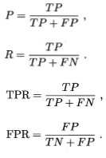
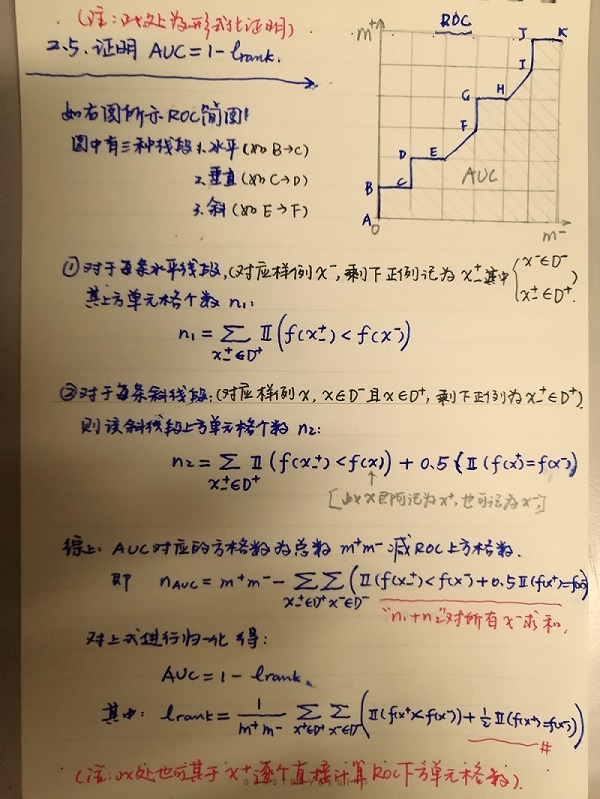
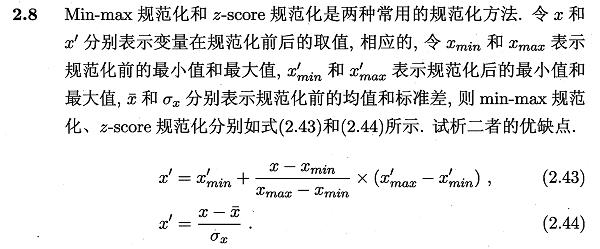

## 习题解答 ##

### 2.1 分层抽样划分训练集与测试集 ###
> 

根据分层采样原则，共有方法： 

.

----

### 2.2 留一法与k-折交叉验证法比较 ###
> 

因为测试集被划分到训练样本中多的类，设一共100个样本：

留一法：测试集1个样本，训练集99个样本且有50个与测试集真实类别不同，故测试集无法被划分到正确的类，错误率**100%**；

交叉验证法：在采用分层抽样的前提下，分类靠随机猜，错误率因为**50%**； 

----

### 2.3 F1值与BEP的关联 ###
> 

首先给出度量定义：

- BEP：是P-R曲线上的平衡点坐标值，BEP = P = R (即准确率 = 召回率)；

- F1值：是P与R的调和平均，1/F1 = (1/P + 1/R) / 2;

所以 BEP = F1 (当P = R时) -> BEP(A) > BEP(B).

----

### 2.4 TPR、FPR、P、R之间的关联 ###
> 
 
给出混淆矩阵示例如下：

> 

然后给出各度量的定义式：

> 

详细解释是：

- P，查准率（准确率），（预测正例）中（真实正例）的比例.
- R，查全率（召回率），（真实正例）中（预测正例）的比例.
- TPR，真正例率，（预测正例）中（真实正例）的比例，TPR = P.
- FPR，假正例率，（真实反例）中（预测正例）的比例.

----

### 2.5 AUC推导（有限样例下） ###
> 

直接给出大致思路如下图：

----

### 2.6 错误率与ROC曲线的关系 ###
> 

错误率可由代价-混淆矩阵得出；

ROC曲线基于TPR与FPR表示了模型在不同截断点取值下的泛化性能。

ROC曲线上的点越靠近（1，0）学习器越完美，但是常需要通过计算等错误率来实现P、R的折衷，而P、R则反映了我们所侧重部分的错误率。

----

### 2.7 ROC曲线与代价曲线的对应关系 ###
> 

ROC曲线的点对应了一对（TPR,FPR），即一对（FNR,FPR），由此可得一条代价线段（0,FPR)--(1,FNR），由所有代价线段构成簇，围取期望总体代价和它的边界--代价曲线。所以说，ROC对应了一条代价曲线，反之亦然。

----

### 2.8 ROC曲线与代价曲线的关系 ###
> 

比较见表：

|Max-min|z-score|
|---|---|
|方法简单|计算量相对大一些|
|容易受高杠杆点和离群点影响|对离群点敏感度相对低一些|
|当加入新值超出当前最大最小范围时重新计算所有之前的结果|每加入新值都要重新计算所有之前结果|

----

### 2.9 卡方检验过程 ###
> 

可直接参考：[卡方检验 - 百度百科](http://baike.baidu.com/link?url=G2Md2m54oqVpFaSGDFjZJ4myZ9EHw8m2HSUx6wgpgE1MnePNrATY-GPjrQD62aRhu4StvgOmaM0xe8alOuyV3uBu3PLJDq2aeo29nz_P4OBE4d4YTLlIkQ3eelB5ByiP)

----

